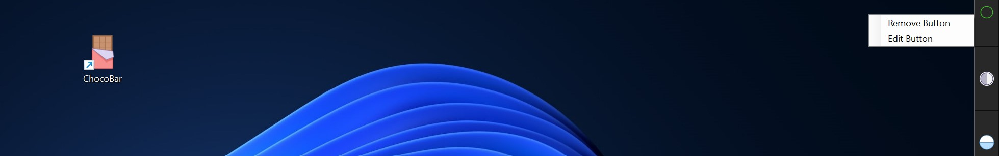
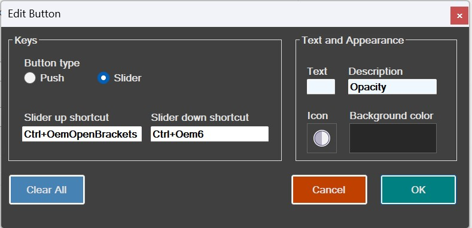

# ChocoBar

Download the installable MSI Setup Package: 

[Download ChocoBar](./Setup/ChocoBarSetup.msi)

**ChocoBar** is a project I built for my own use and now have open sourced it.  It is a Windows desktop toolbar with capabilities to add hot keys and screen recording.  You can add to the tool the frequently used hot keys in your favorite applications for quick access to those functionalities directly from the desktop while the application is running on the Desktop. The keystrokes will be sent to the currently active application on the Desktop.  Digital art is one of my hobbies, and this app was originally written as a tool to ease the digital art workflow on a laptop with touchscreen/stylus input capability.  The specific art workflow scenario was addressed as follows:
- I would run my digital art program on the Desktop.
- The toolbar would run on the Desktop with various app functionalities mapped as shortcuts on the toolbar.
- Whenever I needed to execute an app functionality, I would invoke it by touching the button or tapping it with the stylus (eg. changing brush size, undo/redo, choose color palette, etc).
- Additionally, I could also make timelapse videos of my ongoing work using the tool application window/screen recording functionality.  The captures will be saved as mp4 videos onto the disk.  

 Even though this app was created for specific art workflow goals in mind, it can be used for any other similar scenarios. For ease of use, a readily installable MSI setup package is also included.  If you decide to use the MSI package, please use it at your own risk, because I do not want to issue a digital certificate, etc., for an open-source project such as this one.

The project is written in C#.NET and certain parts in C++. For the Windows toolbar functionality, the project makes calls to a number of underlying Win32 API functions. The core desktop toolbar functionality is achieved using Win32 AppBar API functions.  Here are the main features of the tool:
- Map keyboard shortcuts to buttons.
- Save toolbar buttons as custom profiles.
- Set position of the toolbar on the right or left of the Desktop (this has not been extensively tested on multi-monitor scenarios, so you may find it buggy)
- Timelapse screenrecording of a selected application running on the Desktop - recording specific applications instead of recording the global Desktop is more handy for certain workflows such as in digital art.  

Given below are some screenshots of the tool running on Windows 11 desktop:

Menu options:

To edit/remove an existing button, right click the button, then choose one of the menu options:

The edit button dialog box looks like below:

