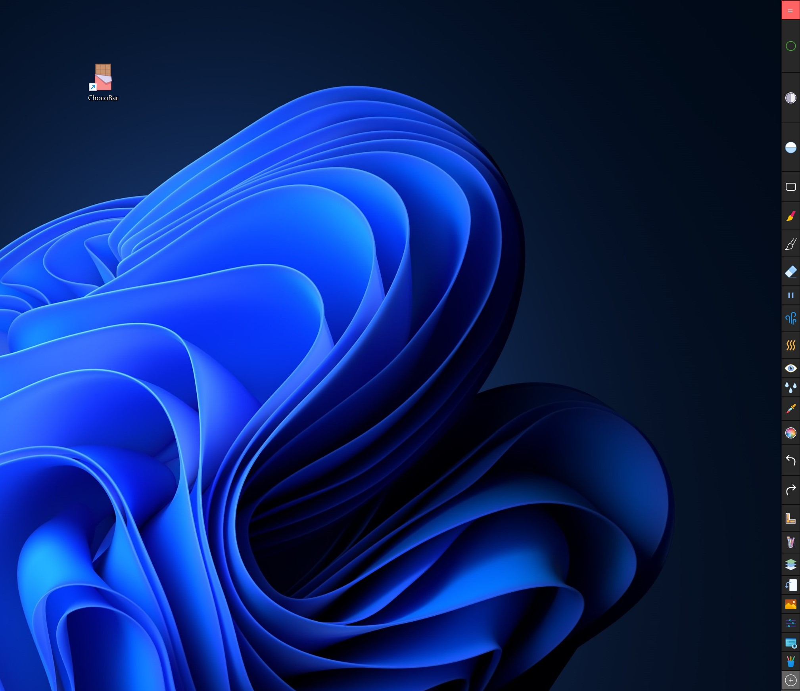
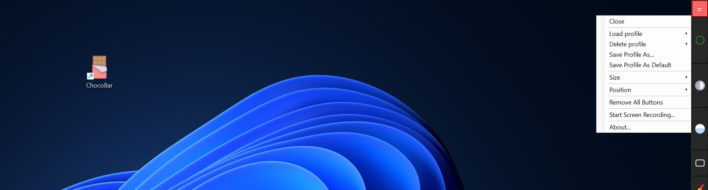

# ChocoBar
ChocoBar is a project I built for my own use and now have open sourced it.  It is a Windows desktop toolbar with capabilities to add hot keys and screen recording.  People like digital artists can add to the tool the frequently used hot keys in their favorite applications for quick access to those functionalities.  They can also make time lapse videos of their work using the tool.  Given below are some screenshots of the tool running on Windows 11 desktop:

Menu options:

